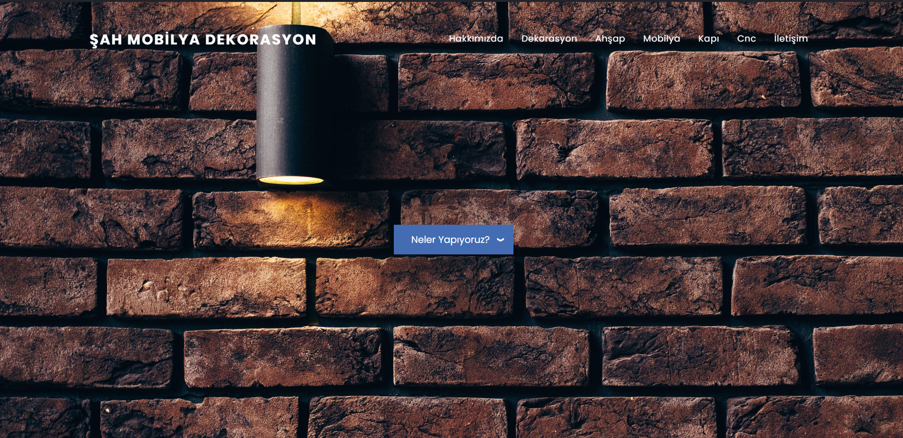
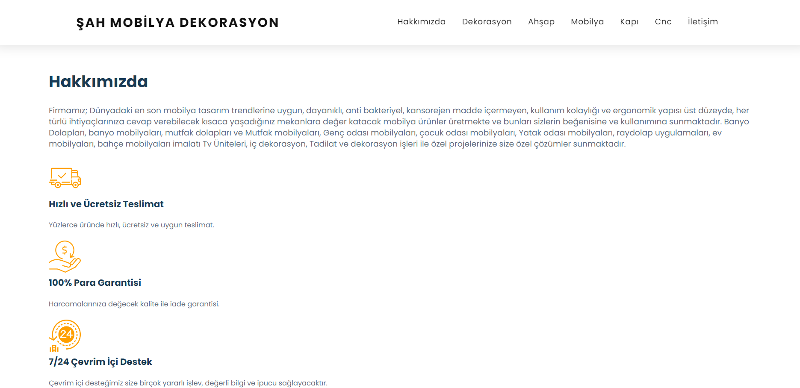
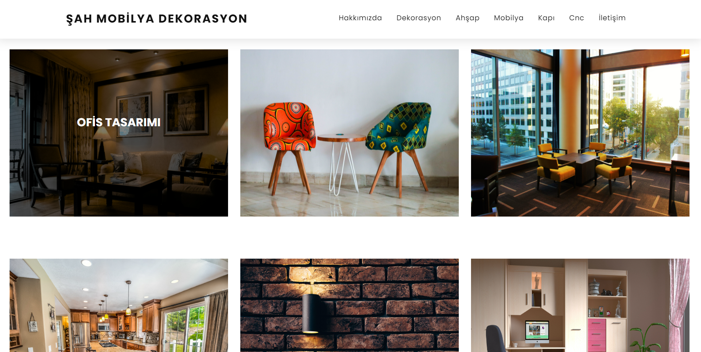
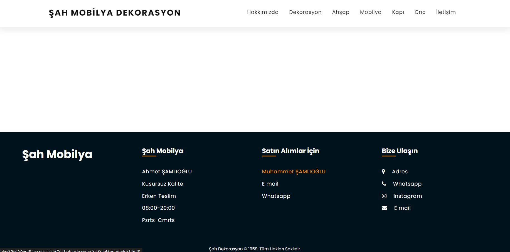

# Şah Mobilya Galeri Web Sitesi

Erzurum, Türkiye’de faaliyet gösteren yerel bir mobilya ve ahşap dekorasyon firması için geliştirilmiş statik ve duyarlı (responsive) tek sayfalı galeri web sitesi.

## Özellikler

- Arka plan görselli tam ekran açılış (hero) alanı
- Bölümlere yumuşak kaydırma sağlayan yapışkan (sticky) gezinme çubuğu
- Aşağıdaki kategoriler için galeri alanları:
  - Dekorasyon
  - Ahşap
  - Mobilya
  - Kapı
  - CNC
- Galeri görselleri üzerinde hover animasyonları ve metin overlay efektleri
- Teslimat, para iade garantisi ve çevrim içi destek bilgilerini içeren **Hakkımızda** bölümündeki servis kartları
- Adres, iletişim bilgileri ve sosyal medya bağlantılarını içeren alt bilgi (footer)



## Kullanılan Teknolojiler

- HTML5
- CSS3 (yerleşim, navigasyon, galeri, hakkımızda bölümü ve footer için özel stiller)
- Vanilla JavaScript (herhangi bir framework kullanılmıyor)
- Google Fonts (Poppins, Open Sans)
- Font Awesome ikon seti

## Proje Yapısı

```text
.
├── index.html         # Ana tek sayfalık layout ve içerik
├── SahMode.css        # Genel layout, banner, header, footer, responsive navigasyon
├── gallery.css        # Galeri grid yapısı, hover efektleri ve responsive davranış
├── about.css          # “Hakkımızda” başlıkları ve servis kartı stilleri
├── nav.css            # “Neler Yapıyoruz?” açılır menü stilleri
├── SahMode.js         # Sticky header, mobil menü aç/kapa, temel form doğrulama
├── foto/              # Logo ve arka plan görselleri (ör. hero background, favicon)
└── rsm/               # Kategoriye göre gruplanmış galeri görselleri
```

> Not: Görsellerin doğru görünmesi için `foto/` ve `rsm/` klasör yapısının `index.html` içindeki yollarla uyumlu olması gerekir.



## Başlarken

1. Depoyu klonlayın veya projeyi ZIP olarak indirin.
2. Proje klasöründe aşağıdaki dizinlerin mevcut olduğundan emin olun:
   - `foto/`
   - `rsm/`
3. `index.html` dosyasını modern bir tarayıcıda doğrudan açın (çift tıklayarak veya tarayıcıya sürükleyerek açabilirsiniz).
4. Herhangi bir build adımı yoktur; proje tamamen statik dosyalardan oluşur.

## Özelleştirme

- **Metin içeriği:** Türkçe metinleri ve başlıkları `index.html` içerisinde güncelleyebilirsiniz (Hakkımızda, galeri başlıkları, açıklamalar).
- **Renk paleti ve tipografi:** Renkler ve genel stil için `SahMode.css`, galeri için `gallery.css`, Hakkımızda kartları için `about.css` dosyalarını düzenleyin.
- **Navigasyon ve bölümler:** Üst menüdeki bağlantılar ile sayfadaki `id` değerleri (`#about`, `#name`, `#name2`, vb.) birbiriyle uyumlu olacak şekilde güncellenmelidir.
- **İletişim bilgileri:** Footer bölümündeki WhatsApp, e-posta, harita ve Instagram bağlantılarını kendi bilgilerinizle değiştirebilirsiniz.



## Notlar

- Arayüz dili varsayılan olarak Türkçedir; çok dilli yapı istenirse `index.html` üzerinde içerik ayrıştırılarak kolayca genişletilebilir.
- Tasarım; temel media query’ler ile masaüstü ve mobil görünümleri destekler. Daha ileri seviyede performans optimizasyonu, bileşenleştirme veya modern bir frontend framework’üne taşıma için bu kod tabanı başlangıç noktası olarak kullanılabilir.



### Ekstra Bilgiler

* **Geliştirici**: [Fatih AYIBASAN] (Bilgisayar Mühendisliği Öğrencisi)
* **E-posta**: [fathaybasn@gmail.com]

---